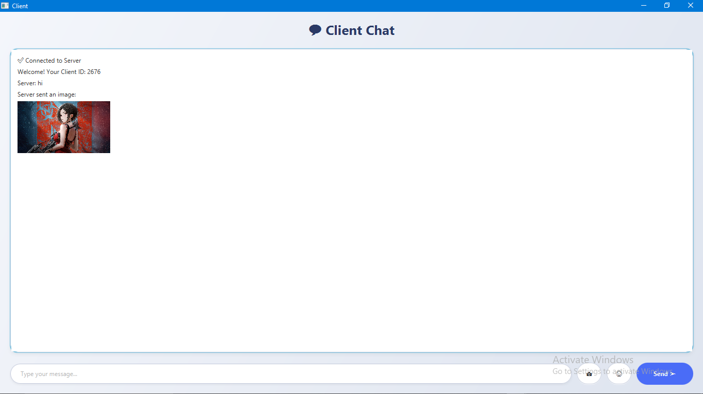

# Simple Chat Application - JavaFX + Socket

A modern, real-time **Chat Application** built with **JavaFX** and **Java Sockets**.  
It allows multiple clients to connect to a single server and exchange **messages**, **emojis**, and **images** with a clean, user-friendly interface.

---

## Features

- Real-time chat between multiple clients using **Java Sockets (TCP/IP)**
- Send and receive text messages instantly
- Share **images** and **emojis**
- Auto-disconnect when the server closes
- Beautiful, modern **JavaFX** UI
- Separate **Server** and **Client** windows
- Multi-threaded message handling
- Lightweight and easy to run

---

## Technologies Used

- **JavaFX 21+** – UI Framework
- **Java Sockets (TCP/IP)** – Networking communication
- **FXML** – UI layout and design
- **Multithreading** – For handling multiple clients simultaneously
- **Maven / Gradle** – Project build and dependency management

---

## Screenshot of server


---


## Screenshot of client



---

## Folder Structure

```text
Simple-Chat-Application/
│
├── screenshots/
│   ├── server-ui.png
│   └── client-ui.png
│
├── src/
│   ├── main/
│   │   ├── java/
│   │   │   └── org/example/
│   │   │       ├── controller/
│   │   │       │   ├── ClientController.java
│   │   │       │   └── ServerController.java
│   │   │       ├── HelloApplication.java
│   │   └── resources/
│   │       └── org/example/simplechatapp/
│   │           ├── client.fxml
│   │           ├── server.fxml
│   └── module-info.java
│
└── README.md
